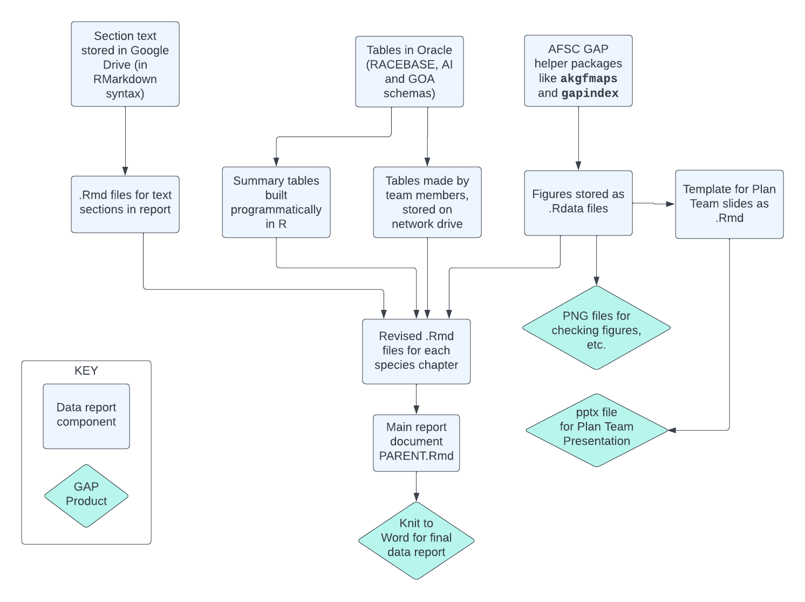

# goa-ai-data-reports (in progress)

## Overview
GOA and AI data reports summarize data from the trawl survey each year. These reports provide detailed survey summaries for a technical audience. The scripts in this repo pull text from [Google Docs](https://drive.google.com/drive/folders/1UAQKChSuKohsRJ5enOloHPk3qFtk5kVC), turn them into R Markdown files, and knit a report in .docx format summarizing survey data and some basic information about the survey. 

## General workflow
To create the full report: 

- Confirm the `tabledate`, `figuredate`, and `reportvaluesdate` in `00_report_settings.R`. 
- If there are changes to the stocks you want to include in the report, edit them in `data/[region]_report_specieslist.csv`
- start with `10_create_report_contents.R` and run the whole script from the top. This builds the tables, figures, and in-text values used in the report. It will save figures and tables to your project directory so you can look at them.
- When you're ready to build a draft of the full report in .docx, double-check the `tabledate`, `figuredate`, and `reportvaluesdate` in `00_report_settings.R`, then run `11_knit_report.R`. This will produce one .docx for the body of the report, and will draw in appendices from their sources.
- Some post-processing is needed in Word: check table widths, order of appendices, and the headers (in navigation pane) to confirm that the scripts have run and the report draft is ready. You may also have to revise some text in the abstract. There is a list of these "post-processing" checks in [To_do_after_knitting_datareport.txt](To_do_after_knitting_datareport.txt). I could automate some of these but honestly it would take a long time to figure out and would only make peoples' lives easier for like 2 days out of the whole year.

> This document is for informational purposes only and does not necessarily represent the views or official position of the Department of Commerce, the National Oceanic and Atmospheric Administration, or the National Marine Fisheries Service. Not to be cited without permission from the authors.

### Structure

As of August 2024, the sections of the report are as follows:

- Preface - drawn straight from google drive
- Abstract - drawn straight from google drive
- Introduction - drawn straight from google drive
- Methods - drawn straight from google drive
- Results 
  - Results by Area - drawn straight from google drive
  - Results by Species - drawn from RMarkdown and automated based on comparisons of size, region, etc.

- Citations
- Appendix A: strata specifications and locations
- Appendix B: Fish and invertebrate taxa encountered - produced with R code
- Appendix C: Length-weight relationships
- Appendix D: Bottom temperatures and surface temperatures

### A note about creating tables and figures
Tables "3" and "4" (CPUE and biomass by survey district and depth, and CPUE and biomass by INPFC area/stratum and depth, respectively) in 2022 were generated by Paul, saved to the G Drive, and pulled from there in this code. In the GOA 2023 report and onwards, these tables are built by the code in this repo.

### A note about using summary tables vs. straight tables from RACEBASE
This report uses some summary tables from GOA, AI, and GAP_PRODUCTS schemas. You could make any of these from RACEBASE straight tables, but it is better IMO to all use the same summary tables.

## Sources of the values in the species chapters:

| Value      | Source |
| ----------- | ----------- |
| INPFC area with highest and second-highest estimated biomass      | GAP_PRODUCTS       |
| INPFC area with largest average length   | Calculated from RACEBASE.SPECIMEN filtered to otolith collections and averaged by species and INPFC area        |
| Where biomass ranks relative to other species (e.g., "species X had the third largest biomass in the survey")   | From AI.BIOMASS_TOTAL table |

## Existing documentation
There are instructions for creating the tables and figures for the GOA data report currently in `G:/AI-GOA/Instructions&Procedures/Data Report`. They should all be updated in this documentation but you can refer to them for historical methods etc.

## Published reports produced using this code

*A [release](https://github.com/MargaretSiple-NOAA/goa-ai-data-reports/releases) is made every time this code is used to produce a Data Processed Report for submission or at publication.*

Siple, M. C., von Szalay, P. G., Raring, N. W., Dowlin, A. N., & Riggle, B. C. (2024). Data Report: 2023 Gulf of Alaska bottom trawl survey. https://doi.org/10.25923/GBB1-X748

von Szalay, P. G., Raring, N. W., Siple, M. C., Dowlin, A. N., Riggle, B. C., and Laman, E. A. (2023) Data Report: 2022 Aleutian Islands bottom trawl survey.  AFSC Processed Rep. 2023-07, 230 p. Alaska Fish. Sci. Cent., NOAA, Natl. Mar. Fish. Serv., 7600 Sand Point Way NE, Seattle WA 98115. https://doi.org/10.25923/85cy-g225

## This code is maintained by:
**Margaret Siple** (margaret.siple AT noaa.gov; @MargaretSiple-NOAA)

**Bethany Riggle** (bethany.riggle AT noaa.gov; @bethanyriggle)

**Alexandra Dowlin** (alexandra.dowlin AT noaa.gov; @AlexandraDowlin-NOAA)

**Ned Laman** (ned.laman AT noaa.gov; @Ned-Laman-NOAA)

Alaska Fisheries Science Center
National Marine Fisheries Service 
National Oceanic and Atmospheric Administration
Seattle, WA 98195

## NOAA disclaimer
This repository is a software product and is not official communication of the National Oceanic and Atmospheric Administration (NOAA), or the United States Department of Commerce (DOC). All NOAA GitHub project code is provided on an 'as is' basis and the user assumes responsibility for its use. Any claims against the DOC or DOC bureaus stemming from the use of this GitHub project will be governed by all applicable Federal law. Any reference to specific commercial products, processes, or services by service mark, trademark, manufacturer, or otherwise, does not constitute or imply their endorsement, recommendation, or favoring by the DOC. The DOC seal and logo, or the seal and logo of a DOC bureau, shall not be used in any manner to imply endorsement of any commercial product or activity by the DOC or the United States Government.

## License
Software code created by U.S. Government employees is not subject to copyright in the United States (17 U.S.C. §105). The United States/Department of Commerce reserve all rights to seek and obtain copyright protection in countries other than the United States for Software authored in its entirety by the Department of Commerce. To this end, the Department of Commerce hereby grants to Recipient a royalty-free, nonexclusive license to use, copy, and create derivative works of the Software outside of the United States.
