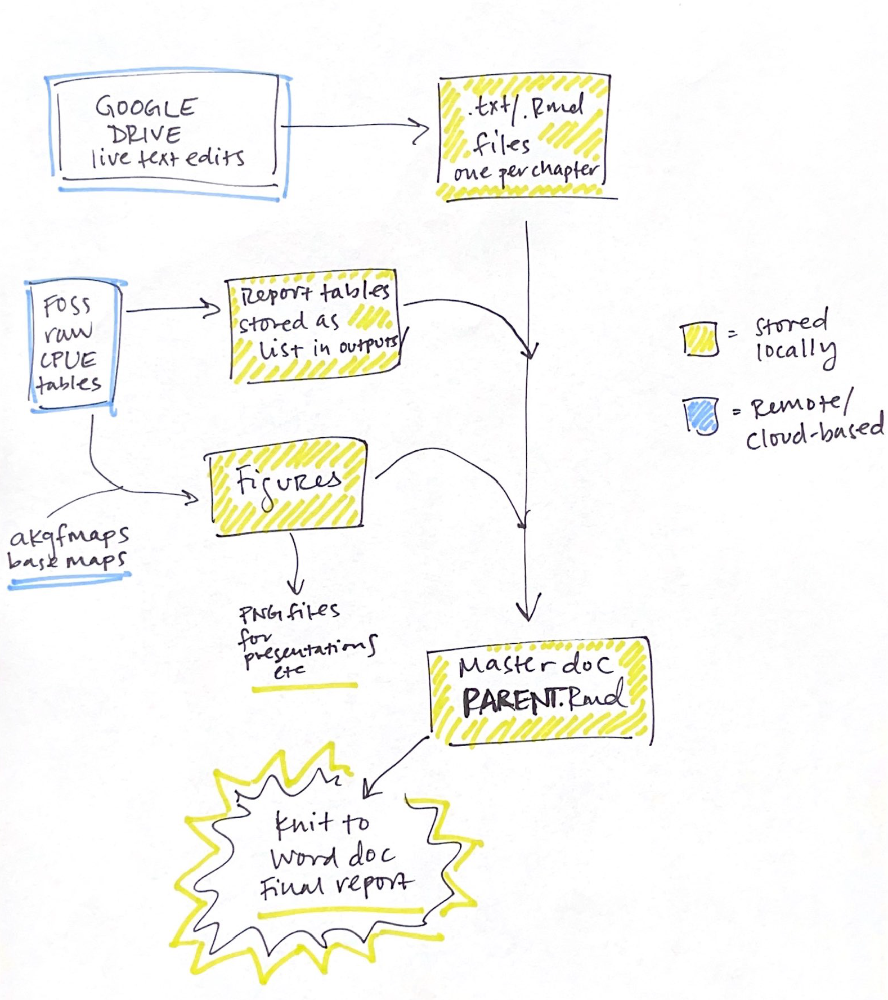

# goa-ai-data-reports (in progress)

## Overview
GOA and AI data reports summarize data from the trawl survey each year. These reports provide detailed survey summaries for a technical audience. This code is adapted from Emily Markowitz's [framework](https://github.com/EmilyMarkowitz-NOAA/gap_bs_data_report) for Eastern Bering Sea data reports. The scripts in this repo pull text from [Google Docs](https://drive.google.com/drive/folders/1UAQKChSuKohsRJ5enOloHPk3qFtk5kVC), turn them into Markdown files, and knit a report in .docx format summarizing survey data and some basic summary information. This is a little change.

> This document is for informational purposes only and does not necessarily represent the views or official position of the Department of Commerce, the National Oceanic and Atmospheric Administration, or the National Marine Fisheries Service. Not to be cited without permission from the authors.

### Structure
The main report sections are:

- Preface (boilerplate)
- Abstract
- Introduction
- Methods (boilerplate)
- Results
- Flatfishes
- Roundfishes
- Rockfishes
- Skates
- Miscellaneous Species
- Citations
- Appendix A: strata Specifications and Locations (BP, until survey redesign ~2023)
- Appendix B: Fish and invertebrate taxa encountered (BP)
- Appendix C: Length-weight relationships
- Appendix D: Bottom temperatures and surface temperatures

### Tables
#### Region (all species)
  * Number of stations allocated, attempted, and successfully completed with sampling
density for the **[Year, Region]** bottom trawl survey by survey district and depth
interval.

  * Mean CPUE (kg/ha) for the 20 most abundant groundfish species in each survey district
during the **[Year, Region]** bottom trawl survey [Note: this caption SAYS groundfish but the species list includes octopus and skates for the AI]

#### Species group (i.e., flatfishes, roundfishes)
For each species group, the component tables are:

  * Catch-per-unit-effort (CPUE), biomass, relative (%) biomass, and cumulative abundance (%) of **[Group]** caught during the **[Year, Region]** bottom trawl survey combined across all survey districts

#### Species
For each species, the component tables are (all examples are from AI):

  *  Summary by survey districts and depth intervals of **[Year, Region]** trawl effort (number of trawl hauls), number of hauls containing **[Species]**, mean CPUE and biomass estimates with lower and upper 95% confidence limits (LCL and UCL, respectively), and average fish weight. 

  * Summary of **[Species]** mean catch-per-unit-effort (CPUE) and estimated biomass (t) including the lower and upper 95% confidence limits (LCL and UCL, respectively) from the **[Year, Region]** bottom trawl survey by stratum (i.e., the composite of survey district, depth interval, and subarea) ordered from highest to lowest CPUE.

### Figures
#### Region (all species)
  * Map of the **[Region, Year]** bottom trawl survey area indicating survey districts 
     - This has a different caption for each region, because it describes each of the survey districts and abbrevs in the caption.

#### Species

For each species, the component figures are:

  * Distribution and relative abundance of **[Species]** from the **[Year, Region]** bottom trawl survey across the a) eastern, b) central, and c)western archipelago.

  * Population length composition of **[Species]** by survey district and depth interval in the **[Year, Region]** bottom trawl survey and number of fish measured.

## Existing documentation
There are instructions for creating the tables and figures for the GOA data report currently in `G:/AI-GOA/Instructions&Procedures/Data Report`. Our goal is to take these and turn them into a Markdown file with documentation. 

## This code is maintained by:
**Margaret Siple** (margaret.siple AT noaa.gov; @margaretsiple-NOAA)
**Bethany Riggle** (bethany.riggle AT noaa.gov; @bethanyriggle)

Alaska Fisheries Science Center
National Marine Fisheries Service 
National Oceanic and Atmospheric Administration
Seattle, WA 98195

## NOAA disclaimer
This repository is a software product and is not official communication of the National Oceanic and Atmospheric Administration (NOAA), or the United States Department of Commerce (DOC). All NOAA GitHub project code is provided on an 'as is' basis and the user assumes responsibility for its use. Any claims against the DOC or DOC bureaus stemming from the use of this GitHub project will be governed by all applicable Federal law. Any reference to specific commercial products, processes, or services by service mark, trademark, manufacturer, or otherwise, does not constitute or imply their endorsement, recommendation, or favoring by the DOC. The DOC seal and logo, or the seal and logo of a DOC bureau, shall not be used in any manner to imply endorsement of any commercial product or activity by the DOC or the United States Government.

## License
Software code created by U.S. Government employees is not subject to copyright in the United States (17 U.S.C. §105). The United States/Department of Commerce reserve all rights to seek and obtain copyright protection in countries other than the United States for Software authored in its entirety by the Department of Commerce. To this end, the Department of Commerce hereby grants to Recipient a royalty-free, nonexclusive license to use, copy, and create derivative works of the Software outside of the United States.
