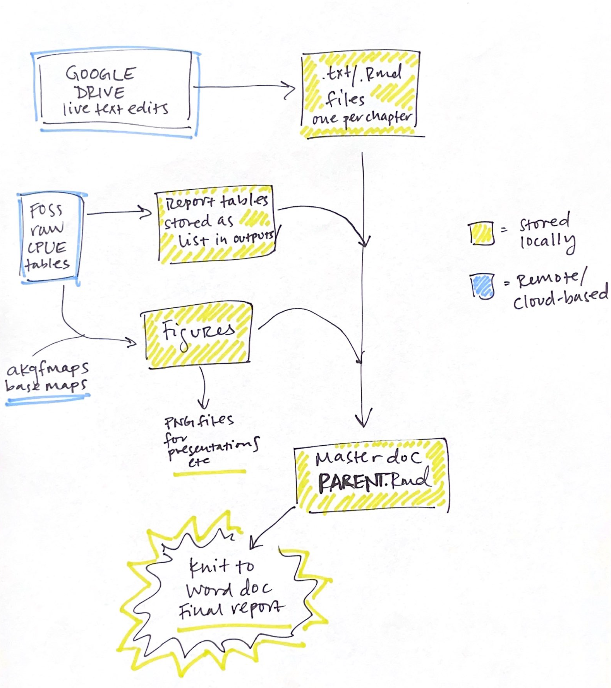

```{r setup, include=FALSE, message=FALSE, warning=FALSE}
knitr::opts_chunk$set(echo = FALSE,dpi=300,fig.width=7)
```

## `r maxyr` AI bottom trawl survey

The `r maxyr` AI bottom trawl survey took place between `r dates_conducted`. The previous AI survey was in `r compareyr` as the 2020 survey was cancelled because of COVID-19.

We surveyed **`r nstations`** stations in total, with a total of **`r nsuccessfulhauls`** successful hauls across the two survey vessels.

## Survey Purpose

To collect standardized and fishery-independent time series of:

-   Relative abundance
-   Distribution
-   Age and biological condition

There are 31 managed species or species groups in the Bering Sea and Aleutian Islands that have stock assessments.

------------------------------------------------------------------------

## Survey design

-   Stratified random survey
-   45 strata defined by geography and depth zone (depth ranges are 1-100, 101-200, 201-300, and 301-500 m)
-   Station allocation based upon abundance, variance, survey area, and economic value
-   15 minute trawls (usually about 1.5 km distance)
-   *Poly Nor 'Eastern* net with rollers & bobbins

------------------------------------------------------------------------

## Data status

-   AI data are finalized as of **September 16th**
-   Age composition will be updated as Age & Growth finish otolith samples
-   CPUE tables will be available on FOSS in the future
-   Collaboration with SMART group to improve data pull and processing steps

------------------------------------------------------------------------

## Automated data reports


In progress at the AFSC GAP products [GitHub page](https://www.github.com/afsc-gap-products/goa-ai-data-reports/).

------------------------------------------------------------------------

## Catch composition

```{r catchcomp}
p2
```

------------------------------------------------------------------------

# Biomass trends

------------------------------------------------------------------------

## Shortraker rockfish

```{r biomass1}
list_biomass_ts[[1]]
```

------------------------------------------------------------------------

## Pacific ocean perch

```{r biomass2}
list_biomass_ts[[2]]
```

------------------------------------------------------------------------

## Blackspotted rockfish

```{r biomass3}
list_biomass_ts[[3]]
```

------------------------------------------------------------------------

## Rougheye rockfish

```{r biomass4}
list_biomass_ts[[4]]
```

------------------------------------------------------------------------

## Atka mackerel

```{r biomass5}
list_biomass_ts[[5]]
```

------------------------------------------------------------------------

## Walleye pollock

```{r biomass6}
list_biomass_ts[[6]]
```

------------------------------------------------------------------------

## Pacific cod

```{r biomass7}
list_biomass_ts[[7]]
```

------------------------------------------------------------------------

## Yellow irish lord

```{r biomass8}
list_biomass_ts[[8]]
```

------------------------------------------------------------------------

## Sablefish

```{r biomass9}
list_biomass_ts[[9]]
```

------------------------------------------------------------------------

## Northern rock sole

```{r biomass10}
list_biomass_ts[[10]]
```

------------------------------------------------------------------------

## Arrowtooth flounder

```{r biomass11}
list_biomass_ts[[11]]
```

------------------------------------------------------------------------

## Whiteblotched skate

```{r biomass12}
list_biomass_ts[[12]]
```

------------------------------------------------------------------------

## Aleutian skate

```{r biomass13}
list_biomass_ts[[13]]
```

------------------------------------------------------------------------

# CPUE by survey region

------------------------------------------------------------------------

## Shortraker rockfish

```{r list_cpue_bubbles1}
list_cpue_bubbles[[1]]
```

## Pacific ocean perch

```{r list_cpue_bubbles2}
list_cpue_bubbles[[2]]
```

------------------------------------------------------------------------

## Blackspotted rockfish

```{r list_cpue_bubbles3}
list_cpue_bubbles[[3]]
```

------------------------------------------------------------------------

## Rougheye rockfish

```{r list_cpue_bubbles4}
list_cpue_bubbles[[4]]
```

------------------------------------------------------------------------

## Atka mackerel

```{r list_cpue_bubbles5}
list_cpue_bubbles[[5]]
```

------------------------------------------------------------------------

## Walleye pollock

```{r list_cpue_bubbles6}
list_cpue_bubbles[[6]]
```

------------------------------------------------------------------------

## Pacific cod

```{r list_cpue_bubbles7}
list_cpue_bubbles[[7]]
```

------------------------------------------------------------------------

## Yellow irish lord

```{r list_cpue_bubbles8}
list_cpue_bubbles[[8]]
```

------------------------------------------------------------------------

## Sablefish

```{r list_cpue_bubbles9}
list_cpue_bubbles[[9]]
```

------------------------------------------------------------------------

## Northern rock sole

```{r list_cpue_bubbles10}
list_cpue_bubbles[[10]]
```

------------------------------------------------------------------------

## Arrowtooth flounder

```{r list_cpue_bubbles11}
list_cpue_bubbles[[11]]
```

------------------------------------------------------------------------

## Whiteblotched skate

```{r list_cpue_bubbles12}
list_cpue_bubbles[[12]]
```

------------------------------------------------------------------------

## Aleutian skate

```{r list_cpue_bubbles13}
list_cpue_bubbles[[13]]
```

------------------------------------------------------------------------

# Length frequencies

------------------------------------------------------------------------

## Shortraker rockfish

```{r list_length_freq1, message=FALSE, warning=FALSE}
list_length_freq[[1]]
```

## Pacific ocean perch

```{r list_length_freq2, message=FALSE, warning=FALSE}
list_length_freq[[2]]
```

------------------------------------------------------------------------

## Blackspotted rockfish

```{r list_length_freq3, message=FALSE, warning=FALSE}
list_length_freq[[3]]
```

------------------------------------------------------------------------

## Rougheye rockfish

```{r list_length_freq4, message=FALSE, warning=FALSE}
list_length_freq[[4]]
```

------------------------------------------------------------------------

## Atka mackerel

```{r list_length_freq5, message=FALSE, warning=FALSE}
list_length_freq[[5]]
```

------------------------------------------------------------------------

## Walleye pollock

```{r list_length_freq6, message=FALSE, warning=FALSE}
list_length_freq[[6]]
```

------------------------------------------------------------------------

## Pacific cod

```{r list_length_freq7, message=FALSE, warning=FALSE}
list_length_freq[[7]]
```

------------------------------------------------------------------------

## Yellow irish lord

```{r list_length_freq8, message=FALSE, warning=FALSE}
list_length_freq[[8]]
```

------------------------------------------------------------------------

## Sablefish

```{r list_length_freq9, message=FALSE, warning=FALSE}
list_length_freq[[9]]
```

------------------------------------------------------------------------

## Northern rock sole

```{r list_length_freq10, message=FALSE, warning=FALSE}
list_length_freq[[10]]
```

------------------------------------------------------------------------

## Arrowtooth flounder

```{r list_length_freq11, message=FALSE, warning=FALSE}
list_length_freq[[11]]
```

------------------------------------------------------------------------

## Whiteblotched skate

```{r list_length_freq12, message=FALSE, warning=FALSE}
list_length_freq[[12]]
```

------------------------------------------------------------------------

## Aleutian skate

```{r list_length_freq13, message=FALSE, warning=FALSE}
list_length_freq[[13]]
```

------------------------------------------------------------------------
