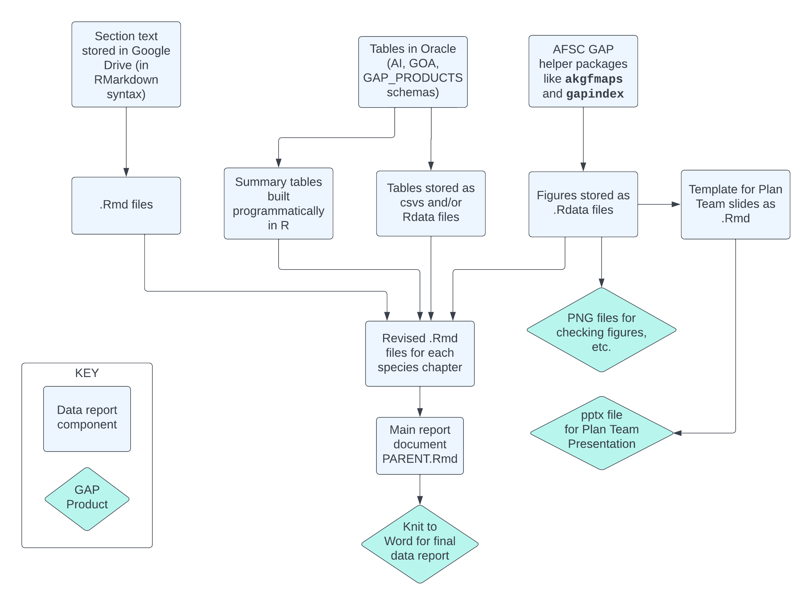

```{r setup, include=FALSE, message=FALSE, warning=FALSE}
knitr::opts_chunk$set(echo = FALSE, dpi = 300, fig.width = 7, warning = FALSE, message = FALSE)
```
## `r maxyr` `r SRVY` bottom trawl survey

The `r maxyr` `r SRVY` bottom trawl survey took place between `r dates_conducted`. The previous `r SRVY` survey was in `r compareyr`.

We surveyed **`r nstations`** stations in total, with a total of **`r nsuccessfulhauls`** successful hauls across the two survey vessels.

:::notes
This is the third year we have instituted some important changes to our survey in an attempt to slow the work pace and reduce the repetitive motion injuries that have been on the rise in recent years.
:::

## Survey charter vessels

:::::: {.columns}
::: {.column}
### F/V Alaska Provider

2013-2016, 2021-Present

8 yrs of charter

Cpt Brian Beaver, first year on AI survey
:::

::: {.column}
### F/V Ocean Explorer

2010-2012, 2017-present

10 yrs of charter experience

Cpt Dan Carney, ~10 yrs experience on survey
:::
::::::

:::notes
Both of our charter vessels have conducted the `r SRVY` survey several times and our skippers are highly experienced, hard bottom draggers

Their experience is crucial to the success of this survey.
:::

## Survey purpose

To collect standardized and fishery-independent time series of:

-   Relative abundance
-   Distribution
-   Age and biological condition

There are `r nrow(report_species)` managed species or species groups in the `r survname_long` presented here.

:::notes
The purpose of our survey is to assess the status of groundfish and invertebrate populations in the `r survname_long` by describing their distribution and abundance along with the length and age composition of the populations
:::

------------------------------------------------------------------------

## Survey design

-   Stratified random survey
-   `r nstrata` strata defined by geography and depth zone
-   Station allocation based upon abundance, variance, survey area, and economic value
-   15 minute trawls (usually about 1.5 km distance)
-   *Poly Nor 'Eastern* net with rollers & bobbins


:::notes
Our survey is a stratified random design that allocates stations to strata based on abundance, variance, stratum area, and economic value
The strata are based on depth, major bathymetric features, and historical INPFC statistical areas.
We randomly allocate stations within this design framework from a pool of previously successfully trawled locations

`r preassignedstationstatement`
:::

------------------------------------------------------------------------

## Data status

-   `r SRVY` data are finalized as of **September 11th**
-   Age composition will be updated as Age & Growth finish otolith samples
-   CPUE tables will be available on FOSS
-   Collaboration with SMART group to improve data pull and processing steps

:::notes
This year we’ve finalized our survey data prior to the September Plan Team meetings and design based estimates along with length composition tables are now available in RACEBASE.
We achieved this through some important innovations (like in-season data editing) and a lot of hard work by our Survey Team


Our CPUE and Effort data will be made available on FOSS, the NMFS Fishery One Stop Shop for data and will also be available as previously on AKFIN.


Links for both of these web-based servers are at the bottom of this slide
:::

------------------------------------------------------------------------

## Collections

:::notes
Now for a quick summary of our collections
:::

------------------------------------------------------------------------

## Species lengths collected

```{r echo=FALSE,tab.cap='Lengths collected for each species in this presentation.', tab.id='lengths-species',  tab.cap.style = "Table caption"}
lengths_species |> 
  flextable(cwidth = 2)
```
:::notes
For the `r nrow(report_species)` species included in this summary, we collected more than `r nfishlengths_reportspps` lengths and a total of around `r nfishlengths` lengths collected overall
One of the changes we instituted this summer to reduce ergonomic strain was based on a stock assessment - survey team collaboration who determined that we could reduce the number of lengths per species and the number of sexed lengths measured
:::


------------------------------------------------------------------------

## Otolith collections

```{r echo=FALSE,tab.cap='Otoliths collected for each species in this presentation.', tab.id='otoliths-species',  tab.cap.style = "Table caption"}
otos_collected |>
  flextable(cwidth = 2)
```

:::notes
We also collected `r total_otos_collected` pairs of otoliths this summer from `r n_oto_species` groundfish species.
:::

------------------------------------------------------------------------

## Other projects and special collections

:::notes
As usual, we had a wide variety of other projects and special collections on our survey

All of the typical projects were represented: IPHC halibut otolith collection, ES60 acoustic backscatter, water column light levels, and Feeding Habits collections

Highlighting a couple of the Special Projects - INSERT SPECIAL COLLECTIONS TO MENTION HERE
:::

------------------------------------------------------------------------

## Automated data reports



In progress at the AFSC GAP products [GitHub page](https://www.github.com/afsc-gap-products/goa-ai-data-reports/).

:::notes
Our data report (and the slides for this presentation) were made in RMarkdown using a relatively new (as of 2022) framework for reproducible reports. In this process, R code is used to draw from shared drives and our survey database, compile them, create figures and tables, and format them for presentation.
:::

------------------------------------------------------------------------

## Catch composition

```{r catchcomp}
p2
```

:::notes
Overall species composition in `r maxyr` was similar to past years with `r highest_biomass_overall` and `r second_highest_biomass_overall` dominating the catches. (INSERT NOTE ABOUT TRENDS IF YOU WANT)
:::

## Bottom temperature (°C)

```{r bottomtemp}
{list_temperature[[1]]}
```

:::notes
This plot shows the full distribution of observed bottom temperatures in the survey. The heat colors show the quantiles of the distribution, and the shaded area is the shape of the full distribution. Surveys with more than 2 boats (these are surveys where the max depth was 1000m) are marked with asterisks.

Min bottom temp: `r minbottomtemp` deg C
Max bottom temp: `r maxbottomtemp` deg C

Larger brown points represent the median, small black points represent individual hauls. Shaded distributions represent the density of measurements. Dotted lines show the mean gear temperature over the past 10 and 20 years.
:::

## Surface temperature (°C)

```{r surfacetemp}
{list_temperature[[2]]}
```

---

## Biomass compared to `r compareyr`

```{r compare_tab}
compare_tab_pres |>
  flextable(cwidth = 2)
```

## Biomass trends

:::notes
Now we’ll take a look at biomass trends, length frequencies, and distribution & abundance for several species.
:::

---

```{r, echo=FALSE, results='asis'}
# NEED TO ADD HERE: CHECKS IF THINGS ARE LOADED INTO ENV AND LOAD THEM IF NOT
# report_species contains the list of species in the report
#

# IMPORTANT PART
src <- list()

for (i in 1:nrow(report_species)) { # nrow(report_species)
  species_code <- report_species$species_code[i]
  spp_name_informal <- report_species$spp_name_informal[i]
  spp_name_informal_sen <- stringr::str_to_sentence(string = spp_name_informal)
  spp_name_scientific <- report_species$spp_name_scientific[i]
  
  src[[i]] <- knitr::knit_expand(here::here("markdown", "SpeciesSlideTemplate.Rmd"))
}

res <- knitr::knit_child(text = unlist(src), quiet = TRUE)
cat(res, sep = "\n")
```
---

## Summary

- Survey data final before September Plan Team
- Growing collaboration with Stock Assessment Team
- INSERT POINT ABOUT WATER TEMPS
- INSERT POINT ABOUT BIOMASS

## Where to find the data

:::: {.columns}

::: {.column}
### the GAP PRODUCTS schema
```{r echo=FALSE, results='asis'}
code <- qrcode::qr_code("https://afsc-gap-products.github.io/gap_products/")
plot(code)
```
:::

:::{.column}
### the {gapindex} package
```{r echo=FALSE, results='asis'}
code <- qrcode::qr_code("https://github.com/afsc-gap-products/gapindex")
plot(code)
```
:::

::::